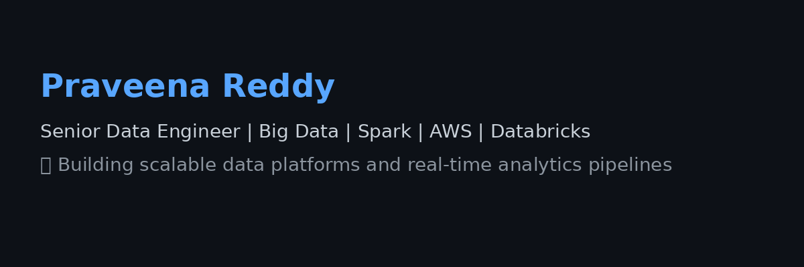

<h1 align="center">Hi 👋, I'm Praveena Reddy</h1>
<h3 align="center">🚀 Senior Data Engineer | Big Data | AWS | Databricks | Spark</h3>

  

---

🔧 **What I Do**

- 🧠 11+ years building large-scale data pipelines and real-time analytics systems  
- ☁️ Expertise in AWS, Databricks, Spark, Airflow, Kafka  
- 📊 Passionate about data quality, observability, and automation  

---

📦 **Projects**

- 🛡️ [Fraud Detection Pipeline](https://github.com/Praveenareddyvanipenta/Fraud-Detection-Pipeline) – Real-time streaming using PySpark, Kafka, Delta Lake  
- ✅ [Data Quality Automation Framework](https://github.com/Praveenareddyvanipenta/Data-Quality-Automation-Framework) – Built with Great Expectations + CI  
- 🧮 [dbt Model Versioning & CI](https://github.com/Praveenareddyvanipenta/dbt-Model-Versioning-CI) – dbt with DuckDB + GitHub Actions  

---

📫 **Connect with Me**

- [LinkedIn](https://www.linkedin.com/in/praveena-v-b65200241/)
- praveena.vanipenta@gmail.com

---

⭐️ _Let’s turn messy data into insights!_
